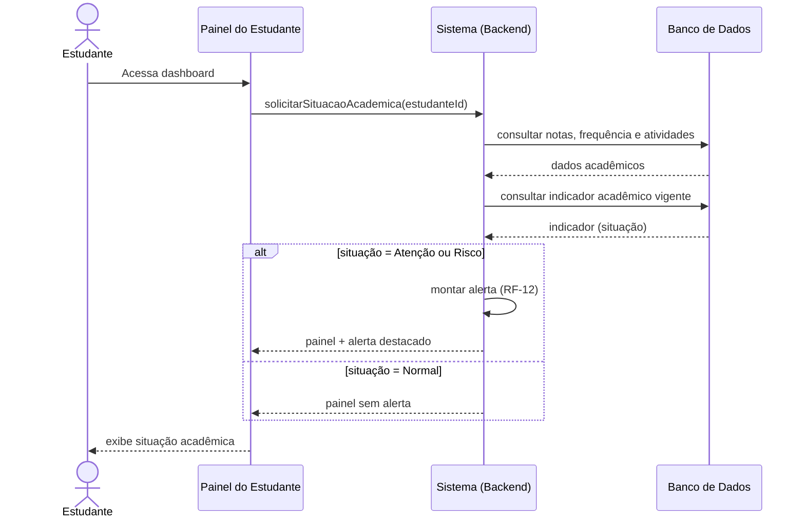

# UC-02 — Consultar Situação Acadêmica

- **Ator**: Estudante
- **Objetivo**: visualizar a própria situação acadêmica (notas, frequência, indicador, alertas)
- **Pré-condições**: estudante autenticado (UC-01 concluído)

**Fluxo principal**
1. Estudante acessa o dashboard.
2. Sistema consulta notas, médias, frequência e atividades do estudante nas turmas em que está matriculado.
3. Sistema recupera o indicador acadêmico vigente de cada turma.
4. Sistema apresenta o painel consolidado com os dados e a situação (Normal/Atenção/Risco).

**Extensão 1 — Situação de risco**
1a. Se a situação em alguma turma for Atenção ou Risco, o sistema destaca a disciplina afetada e exibe o alerta correspondente. (RF-12)

**Extensão 2 — Atividade atrasada**
1b. Se houver atividade sem entrega após o prazo, o sistema sinaliza a atividade como atrasada no painel. (RF-09, RB-08)

**Exceções**
- Estudante sem turmas: sistema exibe painel vazio com orientação para procurar a coordenação.

**Pós-condições**: estudante visualiza sua situação acadêmica atualizada.
**Regras aplicadas**: RB-05, RB-06, RB-07, RB-09, RB-10.

## Diagrama de sequência e aplicações

