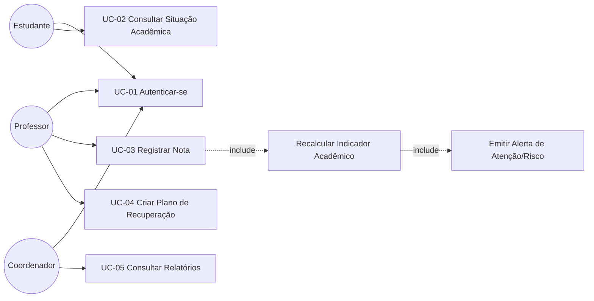

# Casos de Uso — StudyTrack

## Diagrama (atores x casos de uso) 

Os casos de uso completos estão em arquivos individuais nesta pasta: `UC-01-autenticar.md`, `UC-02-consultar-situacao-academica.md`, `UC-03-registrar-nota.md`, `UC-04-criar-plano-recuperacao.md`.
