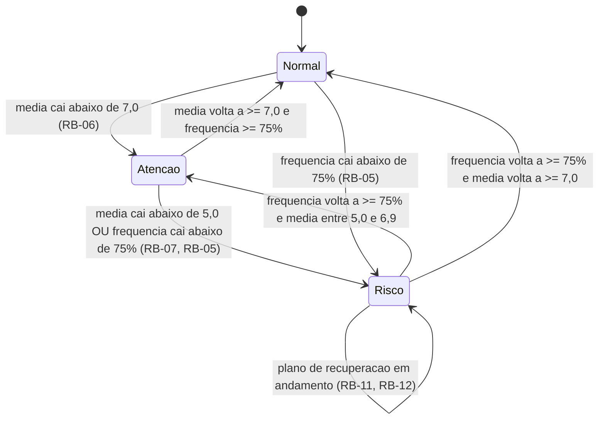

# Diagrama de Estados — Situação Acadêmica

Modela os estados e transições da Situação Acadêmica de um estudante (atributo `situacao` de IndicadorAcademico), com base nas regras RB-05, RB-06, RB-07, RB-09 e RB-10.

## Estados
- **Normal**: média ≥ 7,0 e frequência ≥ 75%.
- **Atenção**: média entre 5,0 e 6,9, com frequência ≥ 75%.
- **Risco**: média < 5,0 OU frequência < 75%.

## Cláusulas EARS derivadas (estados e exceções)

- WHILE a frequência do estudante estiver abaixo de 75%, o sistema SHALL manter a situação acadêmica como Risco, independentemente da média. (RB-05)
- WHILE um estudante estiver em situação de Risco, o sistema SHALL permitir que um professor crie ou acompanhe um plano de recuperação para ele. (RB-11)
- WHILE um plano de recuperação estiver ativo, o sistema SHALL recalcular seu progresso a cada atividade concluída. (RB-12)
- IF a média do estudante cair abaixo de 5,0 OU a frequência cair abaixo de 75%, THEN o sistema SHALL transicionar a situação acadêmica para Risco. (RB-07, RB-05)
- IF a média do estudante estiver entre 5,0 e 6,9 E a frequência for igual ou superior a 75%, THEN o sistema SHALL transicionar a situação para Atenção. (RB-06)
- IF a média for igual ou superior a 7,0 E a frequência for igual ou superior a 75%, THEN o sistema SHALL transicionar a situação para Normal.

## Diagrama de estados

